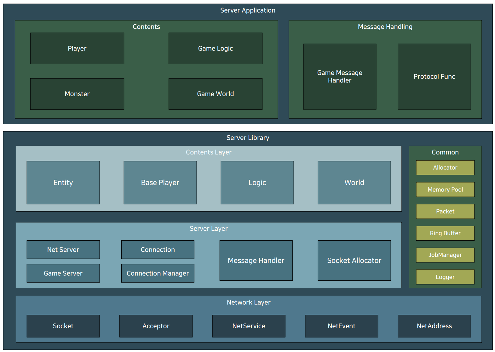
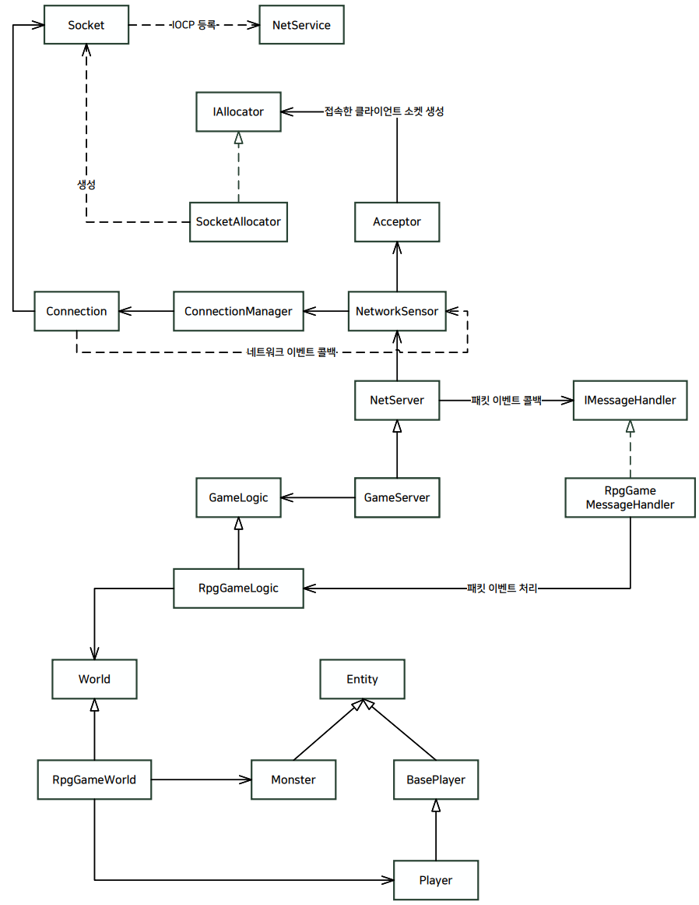

# 2D MMORPG GameServer

## 개요
MMORPG 기능을 지원하는 게임 서버 프레임워크입니다..
멀티스레드 서버인 NetServer, 싱글스레드 로직의 GameServer를 지원하며 
World, Player등 게임에서 사용되는 모듈들을 사용하여 쉽게 서버를 만들 수 있습니다.
영상 링크 : https://www.youtube.com/watch?v=3UX_ufFxsw4&t=6s
  





## 목차
* 지원 기능
* 사용 예제
* NetServer
* GameServer
* 패킷 송 수신 방법
* World
* Player

## 지원 기능
* NetServer : 일반적인 멀티스레드 지원 서버 (로그인, 채널, 로비 등)
* GameServer : 싱글스레드 로직 게임 서버
* World : 섹터 처리
* Player : 게임 플레이어
* Logger : 멀티스레드 Logger
* JobManager : 비동기 잡 시스템
* NetPacket : 패킷 시리얼라이즈, 디시리얼라이즈

## 사용 예제
### NetServer
```C++
#include <NetworkLib.h>

class TestMessageHandler : garam::net::IMessageHandler
{
public:
    void OnClientJoin(garam::net::ClientInfo* client) override;
    void OnClientLeave(garam::net::ClientInfo* client) override;
    void OnPacketReceive(garam::net::ClientInfo* client, garam::net::NetPacket* packet) override;
    void OnUpdate(float deltaTime) override;
};

int main()
{
    short port = 6000;
    int ccu = 4000;

    TestMessageHandler* handler = new TestMessageHandler();
    garam::net::NetServer server(port, ccu, handler);

    server.Run();
}
```
IMessageHandler 인터페이스를 구현하여 NetServer 생성자에 넣어줍니다.
서버가 처리한 네트워크 이벤트들은 사용자가 구현한 MessageHandler의 함수를 호출합니다.

### GameServer
```C++
#include <NetworkLib.h>

class TestGameLogic : public garam::net::GameLogic
{
public:
    TestGameLogic();
    ~TestGameLogic();

    void OnUpdate(float deltaTime) override;
};

class TestMessageHandler : garam::net::IMessageHandler
{
public:
    void OnClientJoin(garam::net::ClientInfo* client) override;
    void OnClientLeave(garam::net::ClientInfo* client) override;
    void OnPacketReceive(garam::net::ClientInfo* client, garam::net::NetPacket* packet) override;
    void OnUpdate(float deltaTime) override;
};

int main()
{
    short port = 6000;
    int ccu = 4000;

    TestGameLogic* logic = new TestGameLogic();
    TestMessageHandler* handler = new TestMessageHandler();
    garam::net::GameServer server(port, ccu, handler, logic);

    server.Run();
}
```

## 패킷 송 수신
```C++
void TestMessageHandler::OnPacketReceive(garam::net::ClientInfo* client, garam::net::NetPacket* packet)
{	
    // 패킷 데이터 추출    
    short data1;
    int data2;
    *packet >> data1 >> data2;

    // 1. 패킷 Alloc
    // 2. 패킷에 데이터를 채워넣고 전송
    garam::net::NetPacket* sendPacket = garam::net::NetPacket::Alloc();
    *packet << data1 << data2;
	
    client->SendPacket(sendPacket);	

    // 사용자가 Alloc한건 사용자가 Free
    garam::net::NetPacket::Free(sendPacket);
}
```

## World
게임 서버에서 사용되는 Entity들의 섹터를 자동으로 처리합니다.

### 콜백 함수
```C++
class TestGameWorld : public garam::net::World
{
public:
    TestGameWorld();
    ~TestGameWorld();

    void OnUpdate(float deltaTime) override;	

protected:
    void OnPlayerJoin(garam::net::BasePlayer* player, std::vector<garam::net::Entity*>& otherEntities) override;					  
    void OnPlayerLeave(garam::net::BasePlayer* leavePlayer) override;
    void ProcessLeaveSector(garam::net::BasePlayer* player, std::vector<garam::net::Sector*>& leaveSectors) override;
    void ProcessNewEnterSector(garam::net::BasePlayer* player, std::vector<garam::net::Sector*>& enterSectors) override;
};
```


* OnPlayerJoin : Player가 World에 추가될 때 호출
* OnPlayerLeave : Player가 World에서 나갈 때 호출
* ProcessLeaveSector : Player가 현재 섹터를 떠날 때 호출
* ProcessNewEnterSector : Player가 새로운 섹터에 진입할 때 호출
